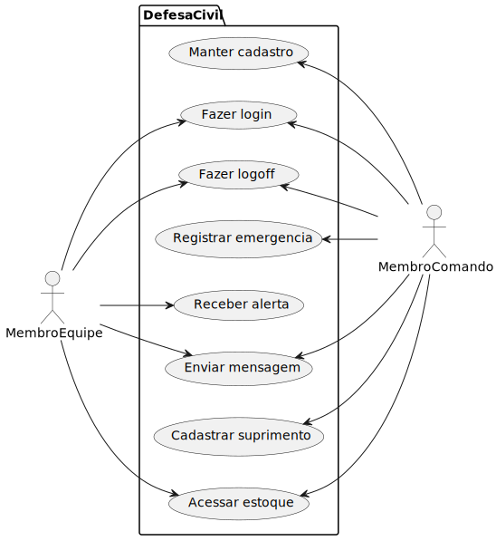

# Software Design Document - SISDEF

## Contextualização
A Defesa Civil enfrenta desafios significativos na coordenação e gestão de recursos durante emergências e desastres naturais, tais como as enchentes que atingiram o RS em 2024. A falta de uma plataforma centralizada dificulta a comunicação eficiente entre as equipes, o rastreamento de suprimentos e a alocação de recursos em tempo real. Isso pode resultar em atrasos críticos na resposta às crises, desperdício de recursos e aumento dos riscos para a população afetada. Nossa tarefa é desenvolver uma solução integrada que facilite a coordenação de esforços, o monitoramento de recursos e a logística de suprimentos. O software deve permitir uma **comunicação mais rápida e precisa**, melhorias na **alocação de recursos** e uma resposta mais **eficiente e eficaz** às emergências, reduzindo assim o impacto dos desastres e garantindo mais qualidade na proteção à população.

## Requisitos Funcionais
- O sistema deve permitir o cadastro, edição e exclusão de usuários com diferentes níveis de acesso.
- O sistema deve oferecer autenticação com login e senha
- O sistema deve permitir o registro de emergências
- O sistema deve suportar notificações automáticas para alertas de emergência.
- O sistema deve permitir o envio de mensagens em tempo real entre equipes de emergências
- O sistema deve permitir o cadastro e rastreamento de suprimentos
- O sistema deve exibir o status do estoque em tempo real e alertar sobre níveis críticos de suprimentos.

## Requisitos não funcionais
- O sistema deve ser acessível via web.
- O sistema deve seguir padrões de usabilidade e acessibilidade (WCAG).
- O sistema deverá estar de acordo com a Lei Geral de Proteção aos Dados (LGPD)

## Diagrama de caso de uso
